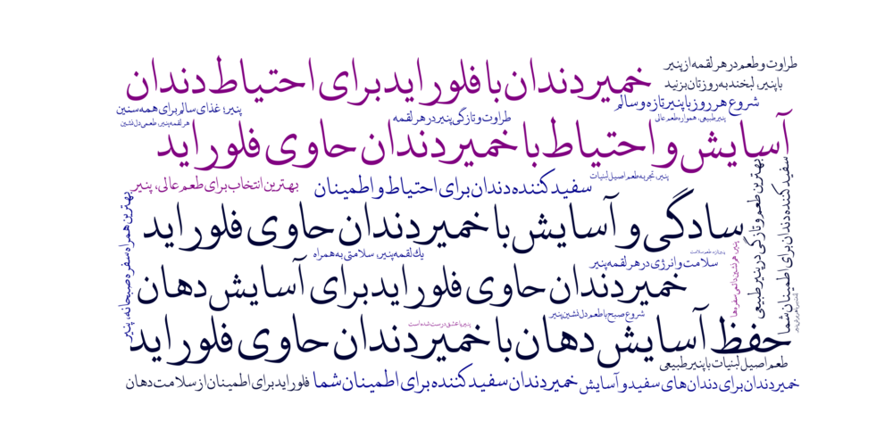

# Sentence and Word Cloud image generator

This repository provides a Python script for generating word clouds from a list of Persian slogans. The slogans used as an example in this project were generated by ChatGPT. You can select from several different color themes to customize the appearance of your word cloud.



## Features
- **Predefined Color Themes:** Choose from various themes to style the word cloud.
- **Customizable Font:** Change the font to support different languages or styles.
- **Easy-to-Use:** Simply provide a list of slogans and an index for the color theme.

## Installation
1. Clone the repository:

2. Install the required Python packages:
    ```bash
    pip install wordcloud matplotlib
    ```

## Usage
1. Replace the `slogans` list with your own slogans in the `slogans` variable.

2. Call the `generate_slogan_wordcloud_with_theme` function with:
   - **slogans:** A list of slogan strings.
   - **output_path:** Path to save the word cloud image.
   - **theme_index:** Index ranging from 0 to 7 representing different color themes.

3. Example usage:
    ```python
    slogans = [
        'حفظ آسایش دهان با خمیردندان حاوی فلوراید',
        'سفید کننده دندان برای اطمینان شما',
        'خمیردندان با فلوراید برای احتیاط دندان',
        'سادگی و آسایش با خمیردندان حاوی فلوراید',
        # Add more slogans as needed
    ]

    output_path = 'wordcloud_slogans_with_theme.png'
    theme_index = 0  # Choose the desired theme index (0 to 7)
    generate_slogan_wordcloud_with_theme(slogans, output_path, theme_index)
    ```

## Color Themes
Each theme is represented by an index (0 to 7). The themes available are:
- **0:** Yellow, Brown, Orange
- **1:** Green, Light Green, Dark Green
- **2:** Gray, Black, Dark Blue Gray
- **3:** Red, Light Red, Crimson
- **4:** Brown, Burnt Brown, Light Brown
- **5:** Pink, Rose, Peach
- **6:** Light Blue, Blue, Light Purple
- **7:** Dark Blue, Purple

## Multilingual Support
This code supports word clouds in any language. Simply provide your slogans in the language of your choice and ensure that a suitable font is specified.
